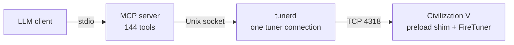

# Agentic MCP tools for Sid Meiers Civilization 5: Brave New World

> **Give your agent a civilization. See what survives.**


*Game image from [Civilization V on Steam](https://store.steampowered.com/app/8930/Sid_Meiers_Civilization_V/).*

# Built for agentic play

A rival settles the river first. Your peaceful science plan now has a border problem. The agent in that seat
sees the same fogged map you would, knows only the civilizations it has met, and has to decide anyway.

This harness puts an AI agent in a real seat in **Sid Meier's Civilization V**. You own the game, you
host the table, and the agent takes a *human* seat: across from you in hotseat or over LAN, in your chair
against the game's AI, or beside other agents in one match. It plays by the same rules as everyone else at
the table and sees no more than you would.


> **Ready to play?** Give an LLM of your choice the [agent install guide](docs/AGENT_INSTALL.md) and ask it
> to set up the harness and start a game. The guide has the commands and checks; this page is for you.
> [Give your agent the raw guide](https://gitlab.com/Tyler-Meador/civ-v-linux-mcp/-/raw/main/docs/AGENT_INSTALL.md).

| Requirements | Current release | Ways to play |
| --- | --- | --- |
| Native Linux Steam build, Brave New World | **1.9.0** · Lua runtime **v252** | Solo · hotseat · LAN · multi-LLM |

## On this page

- **Before you start**
  - [What you need](#what-you-need)
  - [Fair play](#fair-play)
  - [Built for how an agentic model plays](#built-for-how-a-model-plays)
- **At the table**
  - [What a game looks like](#what-a-game-looks-like)
  - [What to expect](#what-to-expect)
  - [Ways to play](#ways-to-play)
- **Under the hood**
  - [How it works](#how-it-works)
  - [Honest limits](#honest-limits)
  - [Documentation](#documentation)
  - [Development](#development)
  - [Authorship](#authorship)
  - [License](#license)

## What you need

| | |
|---|---|
| **The game** | Sid Meier's Civilization V with Brave New World on your own Steam account, as the native Linux build. Steam downloads it once you turn Proton off for the game. |
| **A Linux desktop** | x86_64 with a display. The game runs in a normal window on your screen. A Steam Deck works ([`docs/DECK_HOWTO.md`](docs/DECK_HOWTO.md)). |
| **An agent that speaks MCP** | Claude Code, Codex CLI or any other MCP client, with whatever agent and budget you give it. Each agent at the table gets its own server. |
| **Python 3.11 or newer** | No compiler and no `uv` needed. |

Setup is one sitting, and your agent does it. Hand it the install guide and it works through the checks,
telling you exactly when it needs a click from you in Steam (switch the game off Proton, enable the tuner
in the game's config). The game itself takes about two minutes to cold start.

## Fair play

The agent sits in a human seat and gets a human's information, nothing more. That is the whole design.

- **Fog of war is fog.** Fogged tiles carry no live units. Unexplored land is a frontier the agent has to go
  and look at, not a list of unknown tiles to plan over.
- **Unmet civilizations do not exist** until the agent meets them. The AI's private plans stay private.
- **Diplomacy goes through the game's own screens.** Deals, demands, peace terms, friendship, denouncement
  and leader conversations are the same ones the AI offers you, with the AI's actual replies. Trades between
  you and the agent work in hotseat and LAN.
- **Refusals mirror the UI.** If the game would not let you click it, the harness refuses it and says why.
  Every screen, hover and refusal reason a human reads is what the agent reads.
- **No back door.** The raw Lua escape hatch is off unless you turn it on.
  [`docs/LIMITATIONS.md`](docs/LIMITATIONS.md) lists what is withheld and why, each item checked against the
  engine.
- **The whole game.** Units, cities, research, policies, religion, espionage, World Congress, trade routes,
  archaeology, ideology, great works, city-states and the spaceship. No shortcut to a victory.

## Built for how a model plays

The world reaches the agent as text shaped to its way of thinking, so it spends tokens on decisions rather
than on scrolling. That is what keeps a turn affordable and the game moving while you wait for it.

- **Tiles as text, at the coordinates the move tools take.** Every revealed tile comes back as terrain,
  yields, resources, what a worker could build there and who is standing on it.
- **The rules once, not on every row.** `reference` is every unit, building, tech, policy, promotion,
  belief and terrain with its effect text, read once from the game's database (mods included). Lists carry
  names and live numbers only, so no hover is paid for twice.
- **One call per turn.** `finish_turn` ends the turn, waits, and comes back with the new turn's status, what
  happened in between, and the agent's own notes. `briefing` folds a whole turn into one compact read:
  about 2.5 KB for a 38-unit empire where the separate reads are 30 KB.
- **It sleeps through quiet turns, by its own choice.** With `skip_quiet_turns` the agent asks to be left
  alone until something a human would look up for: combat, a leader at the door, an empty city, happiness
  falling, a threat beside a unit on the move. the agent picks how many turns to let pass; the harness only
  ever wakes it early.
- **Standing orders.** `give_order` hands a unit a short plan (walk there, build a farm; heal to 80%, go
  back, fortify) that runs itself at the start of each turn through the ordinary move tools. The moment
  anything unplanned happens it pauses and hands the unit back with a reason. It never attacks, declares war
  or ends the turn on its own.
- **Assignments and a notebook that survive amnesia.** `assign` gives a unit or city a role, a target and a
  done-when, and every briefing re-checks it against what the seat can see now. `remember` / `recall` keep
  the plan, threats and promises beside the game. Both outlive a context reset, so a model that forgets
  everything mid-game picks its own plan back up.
- **It looks before it leaps.** `tactical_view` is a unit's six neighbours with what a move would do there
  (attack, open, refused with why, enemy). `compare` lays out a few production, research or worker options
  side by side with costs, turns and effects. Neither picks for the agent.
- **Batches and safe retries.** `do` runs a list of orders and stops at the first refusal. An `action_id`
  makes a retried call a replay, never a second move.
- **It knows when it has won.** The last spaceship part's reply says `game_over` and `victory: "science"`,
  `spaceship_status` reads `complete`, and the `game_over` gate names `exit_to_main_menu`; the engine's own
  end-turn blocker freezes at that moment and is not the read to trust.

<details>
<summary>The fine print: measurements and edge cases</summary>

- **`briefing` measured live.** Over four hotseat turns played both ways (`docs/NOTES.md`): 4.25 calls a turn
  against 8 with the separate reads, no refused order against two, about the same bytes.
- **`tactical_view` never guesses.** Adjacency and map wrap come from the engine. No path cost or
  turns-to-reach: the engine cannot give them safely, so the view leaves them out. Nothing fogged is called safe.
- **`compare` keeps a tile's own gain apart from the empire's** (nothing until a city works it) and never
  calls a trade destination safe under fog.
- **What an assignment review can report.** `on_track`, `condition_met`, or `needs_review` with the
  observation behind it: a unit gone (an upgrade on its last plot is named), a reused id never followed, a
  city lost, a settle site now too close to a city, or a target out of sight kept as last seen, never assumed
  gone. `amend_assignment` and `close_assignment` do the rest.
- **What pauses a standing order.** A hostile in sight, damage, an enemy on the destination, a refused step,
  no progress, or a direct command to that unit.
- **What wakes `skip_quiet_turns`.** Combat, a leader message, an empty city, happiness falling, a new
  strategic-resource shortfall, or a barbarian camp or hostile unit beside a unit on its way somewhere.
- **After a context reset**, a briefing carries the latest notes again and every assignment is re-checked.

</details>

## What a game looks like

the agent plays through tool calls; you watch the game window. On its turn it checks what changed, inspects
its cities and units, chooses actions the game permits, then ends the turn. In hotseat the window passes
back to you and you take your turn as usual. the agent's loop looks like this:

```
finish_turn -> (status, digest, notes; or briefing=true) -> briefing / overview / units / cities / known_world
-> act (check available_* first) -> turn_status until nothing blocks -> remember(plan) -> finish_turn
```

When something blocks the turn, the status names it and points to the tool that clears it. Refused actions
explain why and what to try instead.

<details>
<summary>A real turn status from a live solo game</summary>

Turn 269, trimmed for width. It predates runtime v217; a status now also names the `seat`, carries the
`gate` to clear first, `happiness` and any `alerts`, and lists automated or already-moving units under
`todo.ongoing`:

```json
{"turn": 269, "my_turn": true, "mode": "single", "blocking_name": "NO_ENDTURN_BLOCKING_TYPE",
 "todo": {"promotions": [], "research_unset": false, "cities": [], "units": []},
 "pending_popups": [], "game_over": false, "notifications": {"live": 2, "held": 99}}
```

</details>

## What to expect

- **It is slow and it costs tokens.** A developed empire means dozens of tool calls per turn. A game to
  victory is a long project; an evening is a few dozen turns. Quiet-turn skipping and standing orders are
  what keep that bill down.
- **Leave the window alone during the agent's turn.** It drives the game's own screens the way a mouse
  would, and a stray click from you lands in its turn.
- **The game crashes sometimes.** The Linux port does, with or without the harness. Quick saves every turn
  in solo (`quick_save` is one call elsewhere), the game's own autosaves and `load_latest` make it a pause,
  not a loss. A supervisor can relaunch the game and rejoin a LAN game on its own.
- **You can read its mind.** Every note the agent writes to itself and every assignment it gives a unit is
  a plain JSON file under `~/.local/share/civ5-harness/notes/`, per game and seat. You can see what it
  planned before you find out whether it worked.

## Ways to play

| Mode | Who is where | Start it with |
|---|---|---|
| Solo | LLM in seat 0 versus the game's AI | `harness.cli start-single --civ CIVILIZATION_ROME` |
| Hotseat | You and the LLM(s) at one machine, turn by turn | `harness.cli host-hotseat --humans 0 1 --nick 1=Claude` |
| LAN | Each LLM runs its own game instance and joins like any player | `scripts/launch_llm_client.sh`, then `harness.cli join-lan <host>` |

All three share the same tools. Several agents in one game each get their own MCP server, one per seat;
every status names the seat it is playing, and `set_seat` moves a server to another human seat without a
restart. The agent cannot take over one of the built-in AI seats; the game does not expose that. To move a
two-seat hotseat game along between sessions, `scripts/hotseat_rounds.py` alternates the seats and stops at
the first turn that needs a decision.

The install guide walks through each mode. Saved states in `saves/` reproduce late-game diplomacy, peace
terms, Venice puppets and a combat lab if you want to drop a model into something interesting on turn one.

## How it works



Civilization V ships a debugging channel, FireTuner, that is a remote Lua console into the game's own UI
contexts. The harness keeps that channel open in multiplayer with a small preload shim, injects a Lua
runtime that ports the stock UI's own logic (combat previews, trade legality, hovers), and drives every
screen the way a mouse would. Because the network only carries player commands in a lockstep simulation, a
real game instance is the only faithful client; that is why the LLM gets one. `docs/ARCHITECTURE.md` has
the long version.

## Honest limits

- Linux only, native Steam build only, Brave New World only. No Windows, no macOS, no Proton.
- With the tuner enabled the game listens on every interface by default. The install guide binds it to
  loopback; do not skip that on a shared network.
- A few end-turn blockers (some World Congress votes, some free-choice popups) have no tool yet; the agent
  is told to stop and ask you. `docs/GAPS.md` is the running audit.
- Movement-cost previews and path overlays are not readable: the engine calls that back them crash the game.
- No hosted CI by choice; the suite runs locally before every push.

## Documentation

- [`docs/AGENT_INSTALL.md`](docs/AGENT_INSTALL.md): the complete install brief for an agent.
- [`docs/PLAYBOOK.md`](docs/PLAYBOOK.md): how a seat should play, turn by turn, with the blocker table. A seat reads it
  from inside the game as `how_to_play(topic)`, with [`docs/TOOL_REPLIES.md`](docs/TOOL_REPLIES.md) (every key of the
  long replies) served the same way.
- [`docs/ARCHITECTURE.md`](docs/ARCHITECTURE.md): layers, information boundary, game modes, repo layout.
- [`docs/LIMITATIONS.md`](docs/LIMITATIONS.md): what the harness will not do, each item checked against the engine.
- [`docs/GAPS.md`](docs/GAPS.md), [`docs/ROADMAP.md`](docs/ROADMAP.md), [`CHANGELOG.md`](CHANGELOG.md): live audit, plan, and the map from package versions to runtime versions.
- [`docs/DECK_HOWTO.md`](docs/DECK_HOWTO.md): running a seat on a Steam Deck.
- [`saves/README.md`](saves/README.md): the reproduction states and what each one shows.

## Development

```bash
sudo apt install lua5.4 liblua5.4-0   # luac for the runtime lint, liblua for the Lua tests
uv sync --group dev
scripts/check.sh            # 1158 tests: the shipped Lua under lupa, the Python layer against fake bridges; no game needed
```

`CIV5_CALL_LOG=/path/calls.jsonl` in the server's environment writes one line per tool call (bytes, trips,
seconds, refusals); `scripts/ledger_report.py` turns it into a per-turn table. Off by default.

The Lua runtime is one file per game domain under `harness/lua/runtime/` (its `README.md` says which file
owns what and how to add one); `harness/runtime_source.py` lists the load order and assembles what is injected.
It carries its own version counter (`RUNTIME_VERSION` in `bootstrap.lua`), bumped on every change to any of
those files, because a running game keeps the old runtime until a newer number arrives; the source digest
re-injects a changed runtime even when the bump was forgotten. Commit subjects carry it as `runtime vNNN`.

Issues and milestones live on GitLab: <https://gitlab.com/Tyler-Meador/civ-v-linux-mcp>.

## Authorship

This project was written by Claude, Anthropic's AI model, working in Claude Code under the direction of
Ty Meador, who owns the game, ran every live session and decided what the harness should and should not do.
Claude Fable 5.1 wrote most of it, with Claude Opus 5, Claude Sonnet 5 and Claude Opus 5.5 on earlier
commits; the `Co-Authored-By` trailers in the git history say which model wrote what. That covers the
reverse engineering of the FireTuner protocol and the game binary, the shim, the Lua runtime, the MCP
server, the tests, the documentation and this README. Ty's
contribution is the design brief, the live verification against the running game, the judgement calls
recorded in `docs/GAPS.md`, and the standard that the seat may see only what a human sees.

## License

[MIT](LICENSE). Sid Meier's Civilization V, its assets and the stock UI Lua quoted in `docs/` belong to
Firaxis Games and Take-Two Interactive and are not covered by this licence; you need your own copy of the
game.
